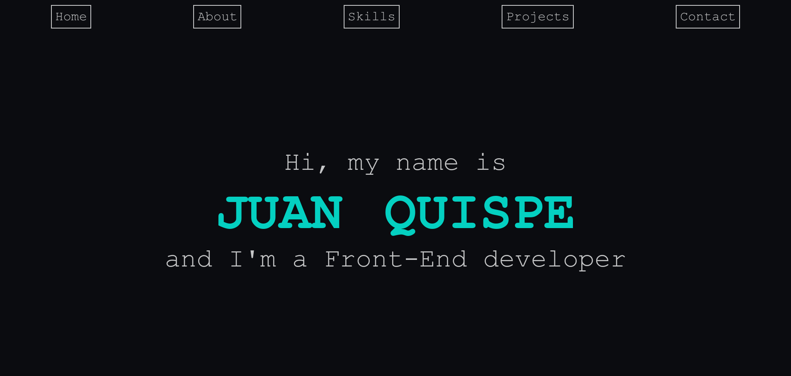

# Portfolio
> English not my first language

Personal portfolio website

## Table of Contents
- [Introduction](#introduction)
- [Technologies](#technologies)
- [Illustrations](#illustrations)
- [To-Do](#to-do)

## Introduction
This project is my portfolio, to show my developer skills. Its built with React using TypeScript, Vite, and SASS.

## Technologies
- [Vite](https://vitejs.dev/) v2.5.6
- [TypeScript](https://www.typescriptlang.org/) v4.4.3
- [SASS](https://sass-lang.com/) v1.39.2

## Illustrations

## To-Do
- Link skill list to API
- Store all images somewhere else